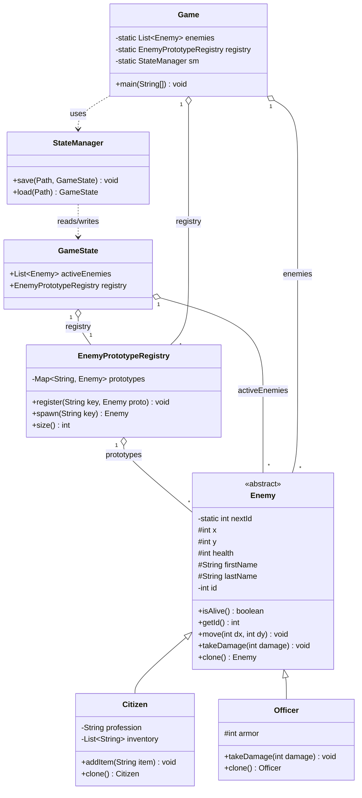

# NPC Manager — Project Description

## 1. Purpose

A small command-line NPC manager built as the OOP semester
artifact. The program lets a user create, mutate, damage, move,
register-as-template, spawn, save and restore a population of game
NPCs. It exercises the OOP topics covered in the course:
inheritance, polymorphism, abstract classes, the Prototype design
pattern, Java serialization, and the Java Collections Framework
(`List`, `Map`).

## 2. Launch

Three supported flows:

| Goal | Command |
|---|---|
| Compile + run with plain `javac`/`java` | `./run.sh` |
| Compile via Maven | `mvn -q compile` then `java -cp target/classes Game` |
| Build the API documentation | `mvn javadoc:javadoc` (output: `target/site/apidocs/index.html`) |

Example REPL session:

```text
> add citizen John Doe Engineer
added #0 John Doe x: 0 y: 0 hp: 100 prof: Engineer inv: []
> add officer Jane Smith
added #1 Jane Smith x: 0 y: 0 hp: 100 armor: 125
> damage 1 200
#1 Jane Smith x: 0 y: 0 hp: 25 armor: 0
> move 0 5 -3
#0 John Doe x: 5 y: -3 hp: 100 prof: Engineer inv: []
> register grunt 1
registered 'grunt' (registry size 1)
> spawn grunt
spawned #2 Jane Smith x: 0 y: 0 hp: 25 armor: 0
> save
[StateManager] save on state-io-worker
saved 3 enemies to save.bin
> quit
```

## 3. Functionality

REPL commands (also printed by `help`):

- `add citizen <first> <last> <profession>` — appends a new `Citizen` to the active list.
- `add officer <first> <last>` — appends a new `Officer` (starts with armor 125).
- `damage <id> <amount>` — applies damage to the enemy whose id matches (armor-aware for officers).
- `move <id> <dx> <dy>` — translates the enemy's position.
- `register <key> <id>` — copies the enemy reference into the prototype registry under `key`.
- `spawn <key>` — clones a fresh enemy from the registered prototype and adds it to the active list.
- `print` / `list` — dumps active enemies and the registry contents.
- `save` — serializes the world to `save.bin` on a worker thread.
- `load` — restores the world from `save.bin` on a worker thread.
- `help` — prints the command list.
- `quit` / `exit` — leaves the REPL.

## 4. Main classes

| Class | Package | Role |
|---|---|---|
| `Game` | (default) | REPL entry point; owns the active list and the registry; dispatches commands. |
| `Enemy` | `npc` | Abstract base for every NPC; `Cloneable` + `Serializable`; shared position / health / id / name. |
| `Citizen` | `npc.civilian` | Civilian variant: `profession` + `ArrayList<String>` inventory. |
| `Officer` | `npc.law` | Law-enforcement variant: armor pool that absorbs damage before health. |
| `EnemyPrototypeRegistry` | `npc` | Prototype-registry pattern: `HashMap<String, Enemy>` keyed by user-chosen name. |
| `GameState` | `npc.io` | Immutable memento bundling active enemies + registry for persistence. |
| `StateManager` | `npc.io` | Caretaker: writes/reads `GameState` on a named worker thread (joined synchronously). |

## 5. Class diagram



`Enemy` additionally implements `java.io.Serializable` and
`java.lang.Cloneable`; `Citizen`, `Officer`, `EnemyPrototypeRegistry`
and `GameState` are all `Serializable`.

## 6. Design patterns used

| Pattern | Classes | Why it qualifies |
|---|---|---|
| **Prototype** | `Enemy.clone()`, `Citizen.clone()`, `Officer.clone()`, `EnemyPrototypeRegistry` | New enemies are created by copying an existing template instead of calling a constructor. `EnemyPrototypeRegistry.spawn(key)` returns `prototypes.get(key).clone()` — the textbook prototype-registry. |
| **Memento** | Originator: `Game`. Memento: `GameState`. Caretaker: `StateManager`. | `Game` snapshots its state into a `GameState`, hands it to `StateManager` for persistence, and later restores it without exposing its own internals. |

## 7. Java collections used

| Field | Declared type | Concrete type | Role |
|---|---|---|---|
| `Game.enemies` | `List<Enemy>` | `ArrayList` | Currently active NPCs, indexed by id via linear scan. |
| `EnemyPrototypeRegistry.prototypes` | `Map<String, Enemy>` | `HashMap` | Prototype templates keyed by user-chosen name. |
| `Citizen.inventory` | `List<String>` | `ArrayList` | Per-citizen item names; deep-copied on clone. |

All three are part of `java.util` and satisfy the "use the Java
Collection framework" requirement.

## 8. Extension possibilities

- **More NPC subclasses** — `Medic`, `Vendor`, `Boss`, each with extra state and overridden `clone()`.
- **Strategy pattern for damage** — extract a `DamageStrategy` interface; `Officer` would inject an `ArmoredDamage` strategy instead of overriding `takeDamage`. Lets damage rules be combined or swapped at runtime.
- **Pluggable persistence** — promote `StateManager` to an interface (`StateStore`) with `FileStateStore`, `JsonStateStore`, `SqliteStateStore` implementations.
- **Command pattern for the REPL** — replace `Game.main`'s `switch` with one `Command` class per verb, registered in a map keyed by verb name.
- **Tag-style metadata via `Set`** — add `Set<String> tags` to `Enemy` for capabilities like `"flying"`, `"undead"`; uniqueness enforced by the collection.
- **Observer pattern for events** — `Enemy` publishes `died` / `moved` events to subscribed listeners (e.g. a logger or a UI).

## 9. Generating the Javadoc

```bash
mvn javadoc:javadoc
# open the result:
xdg-open target/site/apidocs/index.html
```

Generation is configured by the `maven-javadoc-plugin` block in
`pom.xml` (Java 17, `-Xdoclint:none` is **not** enabled — warnings will
surface if any new public API is left undocumented).
